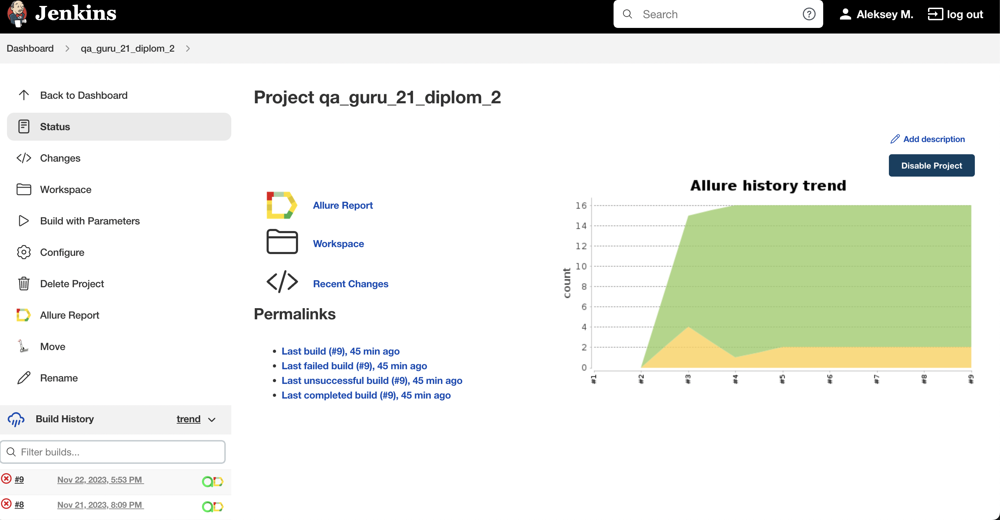
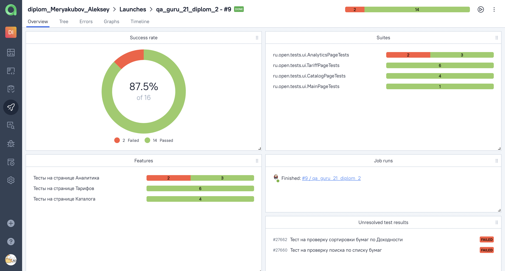
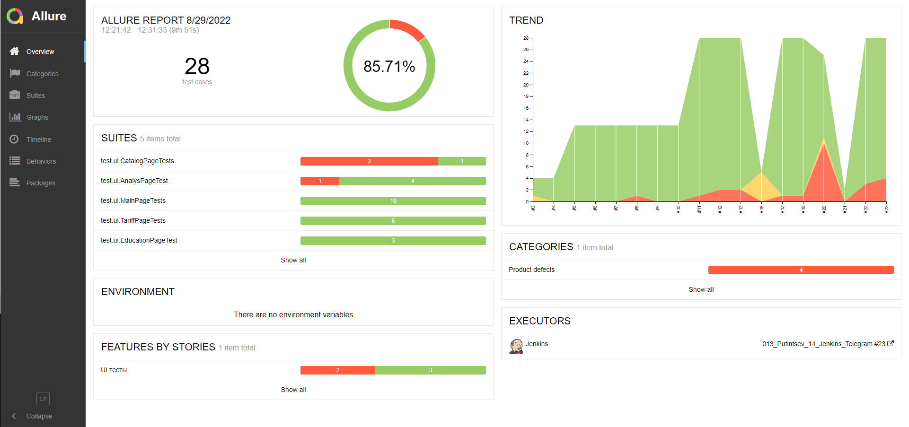
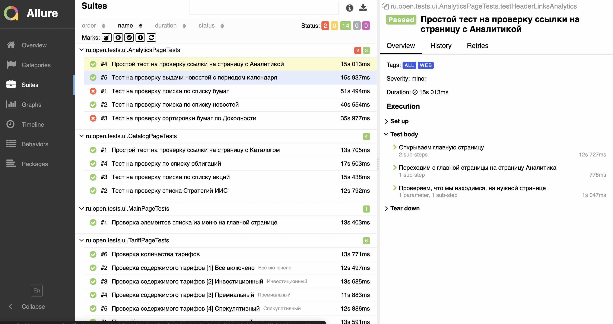
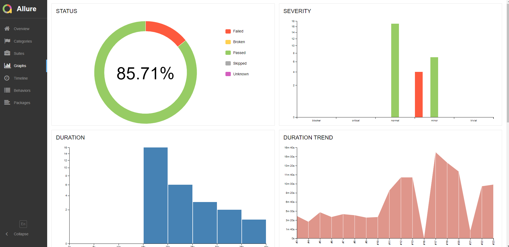
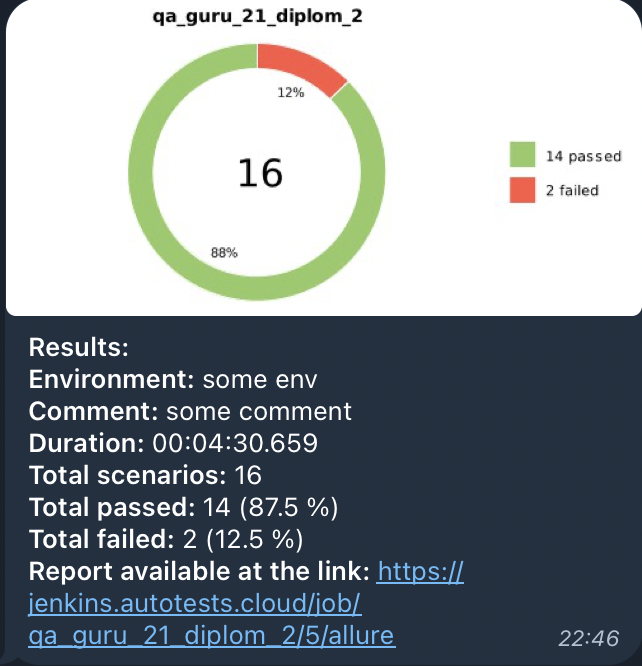
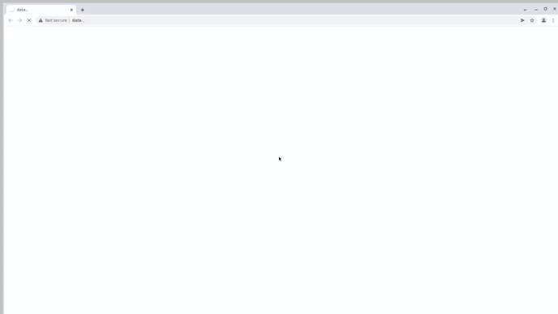
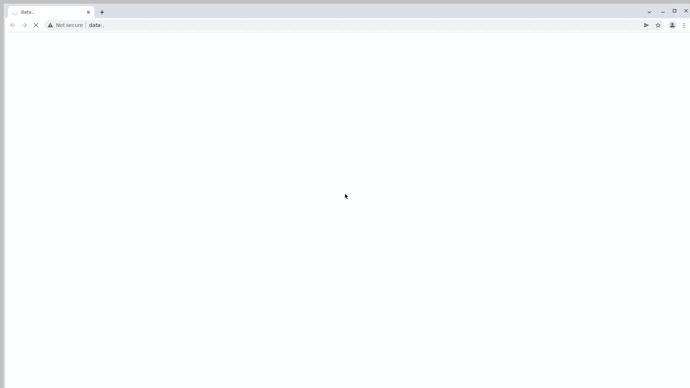

# Проект по автоматизации тестирования Открытие инвестиции
<a href="https://open-broker.ru/invest/"></a>

## Содержание:

- [Технологии и инструменты](#Technology)
- [Реализованные проверки](#Checks)
- [Сборка в Jenkins](#Jenkins)
- [Запуск из терминала](#RemoteLaunch)
- [Allure TestOps отчет](#AllureTestOps)
- [Allure отчет](#Allure)
- [Отчет в Telegram](#Telegram)
- [Видео примеры прохождения тестов](#Video)
<h1 align="left">
<a name="Checks"><i>Реализованные проверки</i></a>
</h1>

- Набор разнообразных UI тестов
- Несколько API тестов


## </a><a name="Jenkins"> Jenkins <a target="_blank" href="https://jenkins.autotests.cloud/job/qa_guru_21_diplom_2/"> job </a></a>
<p align="center">
<a href="https://jenkins.autotests.cloud/job/qa_guru_21_diplom_2/"></a>
</p>

### Параметры сборки в Jenkins:
- tag (Вид тестов WEB,API) - обязательный параметр
- Host (Удаленно или локально) - обязательный параметр
- browser (браузер, по умолчанию chrome)
- version (версия браузера, по умолчанию 99.0)
- size (размер окна браузера, по умолчанию 1920x1080)

## <a name="RemoteLaunch">Запуск тестов из терминала</a>

Локальный запуск (UI тестов локально):
```
gradle clean test -Dtag=WEB -Dremote=false 
```

Удаленный запуск с Jenkins:
```
clean
test
-Dtag=${Tag}
-Dhost=${Host}
-Dbrowser=${Browser}
-DbrowserVersion=${Browser_version}
-DbrowserSize=${Browser_Size}
```
## </a><a name="AllureTestOps"> Отчет в <a target="_blank" href="https://allure.autotests.cloud/launch/32606">Allure TestOps</a></a>

### Страница проекта

<p align="center">

</p>

### Страница запуска

<p align="center">

</p>

### Реализованные тесты

<p align="center">

</p>

### Тест с использованием API

<p align="center">

</p>

### Список ошибок

<p align="center">

</p>

## </a><a name="Allure"> Отчет в <a target="_blank" href="https://jenkins.autotests.cloud/job/qa_guru_21_diplom_2/9/allure/">Allure report</a></a>

### Основное окно

<p align="center">

</p>

### Тесты

<p align="center">

</p>

### Графики

<p align="center">

</p>

## </a><a name="Telegram"> Уведомление в Telegram при помощи бота</a>

<p align="center">

</p>


## </a><a name="Video"> Видео прохождения теста</a>

<p align="center">

 
 
</p>

